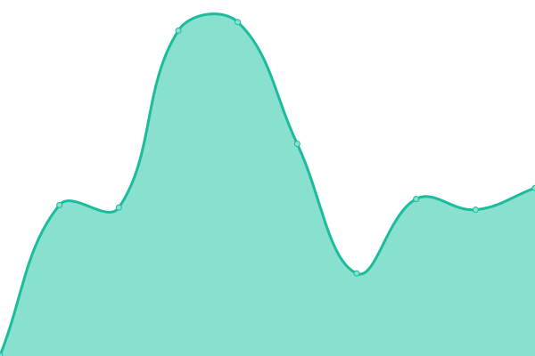

# [📈 Live Status](https://SDS1337.github.io/upptime): <!--live status--> **🟩 All systems operational**

This repository contains the open-source uptime monitor and status page for [Sid](https://SDS1337.github.io/upptime), powered by [Upptime](https://github.com/upptime/upptime).

With [Upptime](https://upptime.js.org), you can get your own unlimited and free uptime monitor and status page, powered entirely by a GitHub repository. We use [Issues](https://github.com/SDS1337/upptime/issues) as incident reports, [Actions](https://github.com/SDS1337/upptime/actions) as uptime monitors, and [Pages](https://SDS1337.github.io/upptime) for the status page.

<!--start: status pages-->
<!-- This summary is generated by Upptime (https://github.com/upptime/upptime) -->
<!-- Do not edit this manually, your changes will be overwritten -->
<!-- prettier-ignore -->
| URL | Status | History | Response Time | Uptime |
| --- | ------ | ------- | ------------- | ------ |
|  [Flixari](https://flixari.xyz) | 🟩 Up | [flixari.yml](https://github.com/SDS1337/upptime/commits/HEAD/history/flixari.yml) | 

 952ms
     
 | 

<a href="https://status.flixari.xyz/history/flixari">100.00%</a>
    

|  [Plex](https://plex.flixari.xyz/web/index.html) | 🟩 Up | [plex.yml](https://github.com/SDS1337/upptime/commits/HEAD/history/plex.yml) | 

 780ms
     
 | 

<a href="https://status.flixari.xyz/history/plex">100.00%</a>
    

|  [Petio (Requests)](https://flixari.xyz/petio/) | 🟩 Up | [petio-requests.yml](https://github.com/SDS1337/upptime/commits/HEAD/history/petio-requests.yml) | 

 524ms
     
 | 

<a href="https://status.flixari.xyz/history/petio-requests">100.00%</a>
    

|  [Docs](https://docs.flixari.xyz/) | 🟩 Up | [docs.yml](https://github.com/SDS1337/upptime/commits/HEAD/history/docs.yml) | 

 1103ms
     
 | 

<a href="https://status.flixari.xyz/history/docs">100.00%</a>
    

|  [Tautulli (Stats)](https://flixari.xyz/tautulli/status/) | 🟩 Up | [tautulli-stats.yml](https://github.com/SDS1337/upptime/commits/HEAD/history/tautulli-stats.yml) | 

 540ms
     
 | 

<a href="https://status.flixari.xyz/history/tautulli-stats">100.00%</a>
    

<!--end: status pages-->

[**Visit our status website →**](https://SDS1337.github.io/upptime)

## 📄 License

- Powered by: [Upptime](https://github.com/upptime/upptime)
- Code: [MIT](./LICENSE) © [Sid](https://SDS1337.github.io/upptime)
- Data in the `./history` directory: [Open Database License](https://opendatacommons.org/licenses/odbl/1-0/)
