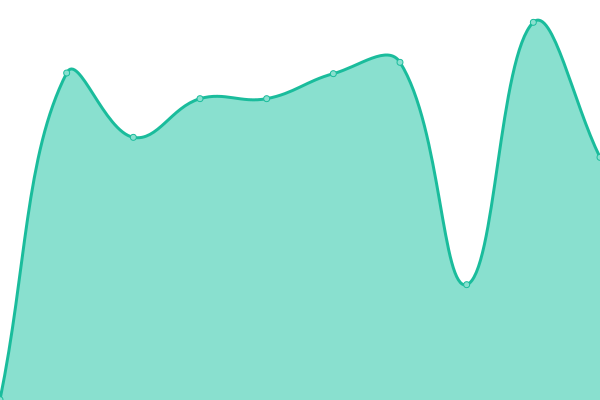

# [📈 Live Status](https://SDS1337.github.io/upptime): <!--live status--> **🟧 Partial outage**

This repository contains the open-source uptime monitor and status page for [Sid](https://SDS1337.github.io/upptime), powered by [Upptime](https://github.com/upptime/upptime).

With [Upptime](https://upptime.js.org), you can get your own unlimited and free uptime monitor and status page, powered entirely by a GitHub repository. We use [Issues](https://github.com/SDS1337/upptime/issues) as incident reports, [Actions](https://github.com/SDS1337/upptime/actions) as uptime monitors, and [Pages](https://SDS1337.github.io/upptime) for the status page.

<!--start: status pages-->
<!-- This summary is generated by Upptime (https://github.com/upptime/upptime) -->
<!-- Do not edit this manually, your changes will be overwritten -->
<!-- prettier-ignore -->
| URL | Status | History | Response Time | Uptime |
| --- | ------ | ------- | ------------- | ------ |
|  [Flixari](https://flixari.xyz) | 🟩 Up | [flixari.yml](https://github.com/SDS1337/upptime/commits/HEAD/history/flixari.yml) | 

 990ms
     
 | 

<a href="https://status.flixari.xyz/history/flixari">99.33%</a>
    

|  [Plex](https://plex.flixari.xyz/web/index.html) | 🟩 Up | [plex.yml](https://github.com/SDS1337/upptime/commits/HEAD/history/plex.yml) | 

 875ms
     
 | 

<a href="https://status.flixari.xyz/history/plex">99.33%</a>
    

|  [Nextcloud](https://nextcloud.flixari.xyz/login) | 🟥 Down | [nextcloud.yml](https://github.com/SDS1337/upptime/commits/HEAD/history/nextcloud.yml) | 

 1049ms
     
 | 

<a href="https://status.flixari.xyz/history/nextcloud">99.40%</a>
    

|  [XBackBone](https://sharex.flixari.xyz/login) | 🟩 Up | [x-back-bone.yml](https://github.com/SDS1337/upptime/commits/HEAD/history/x-back-bone.yml) | 

 907ms
     
 | 

<a href="https://status.flixari.xyz/history/x-back-bone">99.71%</a>
    

|  [Petio](https://flixari.xyz/petio/) | 🟩 Up | [petio.yml](https://github.com/SDS1337/upptime/commits/HEAD/history/petio.yml) | 

 817ms
     
 | 

<a href="https://status.flixari.xyz/history/petio">99.33%</a>
    

|  [Jackett](https://flixari.xyz/jackett/UI/Login/) | 🟩 Up | [jackett.yml](https://github.com/SDS1337/upptime/commits/HEAD/history/jackett.yml) | 

 797ms
     
 | 

<a href="https://status.flixari.xyz/history/jackett">99.33%</a>
    

|  [AdGuard](https://adguard.flixari.xyz/login.html) | 🟩 Up | [ad-guard.yml](https://github.com/SDS1337/upptime/commits/HEAD/history/ad-guard.yml) | 

 814ms
     
 | 

<a href="https://status.flixari.xyz/history/ad-guard">99.71%</a>
    

|  [Radarr](https://flixari.xyz/radarr/activity/queue/) | 🟩 Up | [radarr.yml](https://github.com/SDS1337/upptime/commits/HEAD/history/radarr.yml) | 

 693ms
     
 | 

<a href="https://status.flixari.xyz/history/radarr">99.33%</a>
    

|  [Sonarr](https://flixari.xyz/sonarr/activity/queue/) | 🟩 Up | [sonarr.yml](https://github.com/SDS1337/upptime/commits/HEAD/history/sonarr.yml) | 

 876ms
     
 | 

<a href="https://status.flixari.xyz/history/sonarr">99.33%</a>
    

|  [Bazarr](https://flixari.xyz/bazarr/system/status) | 🟩 Up | [bazarr.yml](https://github.com/SDS1337/upptime/commits/HEAD/history/bazarr.yml) | 

 750ms
     
 | 

<a href="https://status.flixari.xyz/history/bazarr">99.33%</a>
    

|  [Tautulli](https://flixari.xyz/tautulli/status/) | 🟩 Up | [tautulli.yml](https://github.com/SDS1337/upptime/commits/HEAD/history/tautulli.yml) | 

 645ms
     
 | 

<a href="https://status.flixari.xyz/history/tautulli">99.33%</a>
    

|  [Flood](https://flixari.xyz/flood/) | 🟩 Up | [flood.yml](https://github.com/SDS1337/upptime/commits/HEAD/history/flood.yml) | 

 763ms
     
 | 

<a href="https://status.flixari.xyz/history/flood">99.33%</a>
    

|  [qBittorrent](https://flixari.xyz/qbittorrent/) | 🟩 Up | [q-bittorrent.yml](https://github.com/SDS1337/upptime/commits/HEAD/history/q-bittorrent.yml) | 

 631ms
     
 | 

<a href="https://status.flixari.xyz/history/q-bittorrent">99.33%</a>
    

|  [Filebrowser](https://files.flixari.xyz) | 🟩 Up | [filebrowser.yml](https://github.com/SDS1337/upptime/commits/HEAD/history/filebrowser.yml) | 

 1001ms
     
 | 

<a href="https://status.flixari.xyz/history/filebrowser">99.33%</a>
    

|  [Netdata](https://flixari.xyz/netdata/) | 🟩 Up | [netdata.yml](https://github.com/SDS1337/upptime/commits/HEAD/history/netdata.yml) | 

 674ms
     
 | 

<a href="https://status.flixari.xyz/history/netdata">99.33%</a>
    

|  [Prowlarr](https://flixari.xyz/prowlarr/) | 🟩 Up | [prowlarr.yml](https://github.com/SDS1337/upptime/commits/HEAD/history/prowlarr.yml) | 

 749ms
     
 | 

<a href="https://status.flixari.xyz/history/prowlarr">99.33%</a>
    

|  [Dozzle](https://flixari.xyz/dozzle/) | 🟩 Up | [dozzle.yml](https://github.com/SDS1337/upptime/commits/HEAD/history/dozzle.yml) | 

 664ms
     
 | 

<a href="https://status.flixari.xyz/history/dozzle">99.34%</a>
    

|  [Code-Server](https://code-server.flixari.xyz/login) | 🟩 Up | [code-server.yml](https://github.com/SDS1337/upptime/commits/HEAD/history/code-server.yml) | 

 973ms
     
 | 

<a href="https://status.flixari.xyz/history/code-server">99.34%</a>
    

|  [Docs](https://docs.flixari.xyz/) | 🟩 Up | [docs.yml](https://github.com/SDS1337/upptime/commits/HEAD/history/docs.yml) | 

 3163ms
     
 | 

<a href="https://status.flixari.xyz/history/docs">99.34%</a>
    

<!--end: status pages-->

[**Visit our status website →**](https://SDS1337.github.io/upptime)

## 📄 License

- Powered by: [Upptime](https://github.com/upptime/upptime)
- Code: [MIT](./LICENSE) © [Sid](https://SDS1337.github.io/upptime)
- Data in the `./history` directory: [Open Database License](https://opendatacommons.org/licenses/odbl/1-0/)
